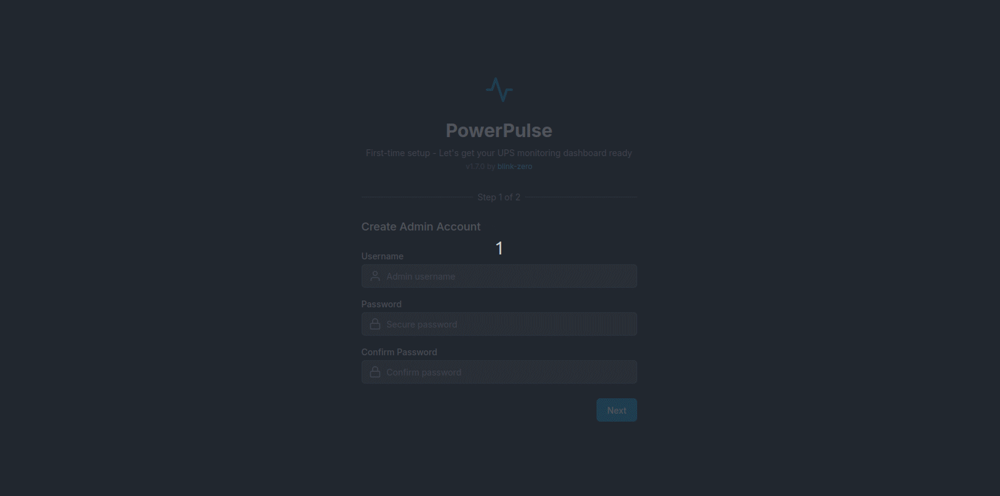

# PowerPulse


PowerPulse is a modern UPS (Uninterruptible Power Supply) monitoring dashboard integrated with Network UPS Tools (NUT). It provides a clean, responsive interface for monitoring and managing your UPS systems.



## Why Use PowerPulse?

- **Real-time Monitoring**: Keep track of your UPS systems' status, battery levels, and power conditions in real-time
- **Multi-channel Notifications**: Receive alerts via Discord, Slack, or email when your UPS status changes
- **Comprehensive Dashboard**: View detailed information about all your UPS systems in one place
- **Historical Data**: Track battery performance over time with built-in history graphs
- **User-friendly Interface**: Modern, responsive design that works on desktop and mobile devices
- **Secure Access**: Role-based authentication system to control access to your UPS monitoring
- **Easy Setup**: Simple installation process with Docker support

## Features

- **UPS Monitoring Dashboard**: View all your UPS systems in a clean, modern interface
- **Detailed UPS Information**: Access comprehensive details about each UPS system
- **Battery History Tracking**: Monitor battery performance over time
- **Multi-channel Notifications**:
  - Discord webhook integration
  - Slack webhook integration
  - Email notifications
- **User Management**: Admin controls for managing users and permissions
- **Customizable Settings**: Configure polling intervals, notification preferences, and more
- **Responsive Design**: Works on desktop, tablet, and mobile devices
- **Dark Mode Support**: Easy on the eyes during those late-night monitoring sessions

## Project Structure

```
powerpulse/
├── assets/                 # Static assets
│   └── images/             # Image files including demo GIF
├── client/                 # Frontend code
│   ├── public/             # Static assets
│   └── src/
│       ├── components/     # Reusable UI components
│       │   └── navigation/ # Navigation components
│       ├── context/        # React context providers
│       ├── hooks/          # Custom React hooks
│       ├── pages/          # Page components
│       ├── services/       # API service layer
│       ├── types/          # Type definitions
│       └── utils/          # Utility functions
└── server/                 # Backend code
    ├── db/                 # Database setup and configuration
    ├── middleware/         # Express middleware
    ├── routes/             # API routes
    │   ├── auth.js         # Authentication routes
    │   ├── nutServers.js   # NUT server routes
    │   ├── upsSystems.js   # UPS systems routes
    │   └── users.js        # User management routes
    ├── utils/              # Utility functions
    │   └── nutClient.js    # NUT client utilities
    ├── app.js              # Express app setup
    └── server.js           # Server entry point
```

## Getting Started

### Prerequisites

- Node.js (v14 or later)
- npm or yarn
- Network UPS Tools (NUT) server

### Installation

#### Standard Installation

1. Clone the repository:
   ```
   git clone https://github.com/blink-zero/powerpulse.git
   cd powerpulse
   ```

2. Install dependencies:
   ```
   npm run install-all
   ```

3. Configure environment variables:
   ```
   cp .env.example .env
   # Edit .env with your configuration
   ```

4. Start the development server:
   ```
   npm run dev
   ```

#### Docker Installation

1. Clone the repository:
   ```
   git clone https://github.com/blink-zero/powerpulse.git
   cd powerpulse
   ```

2. Configure environment variables:
   ```
   cp .env.example .env
   # Edit .env with your configuration
   ```

3. Start with Docker Compose:
   ```
   docker-compose up -d
   ```

### Testing with Sample Data

To generate test battery history data for development and testing:

1. Make sure your server is running and you have at least one UPS system configured
2. Run the test data generator:
   ```
   cd server
   chmod +x scripts/run-test-data-generator.sh
   ./scripts/run-test-data-generator.sh
   ```

This will generate 24 hours of simulated battery history data for all configured UPS systems, which is useful for testing the battery history graph functionality.

## Documentation

- [Client Documentation](client/src/README.md): Details on frontend components and services
- [Server Documentation](server/README.md): Information about the backend API and architecture
- [Changelog](CHANGELOG.md): History of changes and version updates

## License

This project is licensed under the MIT License - see the LICENSE file for details.
